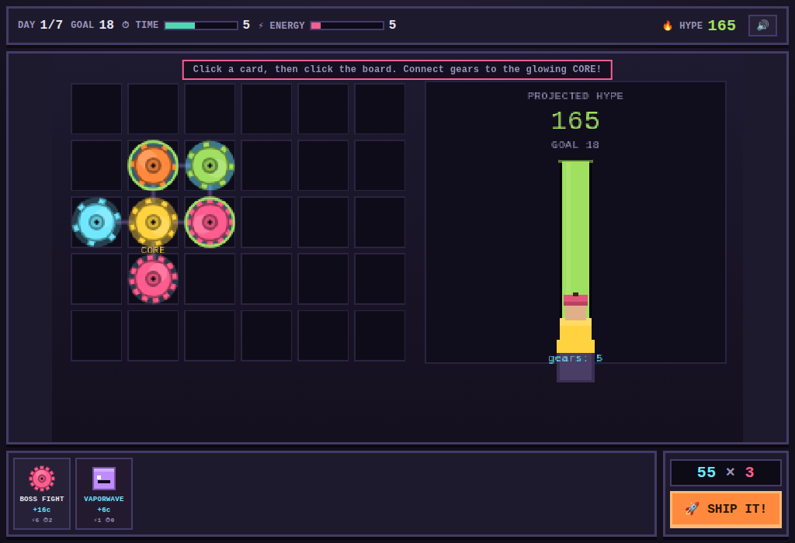

# 🎮 Game Jam Simulator

A silly 2D pixel-art simulator about surviving a 7-day game jam. You have a
desk, a computer, a mini-fridge full of questionable energy drinks, and a
looming deadline. Build your game by **connecting gears** (mechanics), slap on
**art styles**, hit the **HYPE** goal — and try not to pass out.

It's a little bit *Balatro*, a little bit *coffee-fuelled crunch*.



## ▶ How to play

**No build step, no dependencies.** Just open `index.html` in any modern browser.

- Double-click `index.html`, **or**
- Serve the folder and visit it, e.g.:
  ```bash
  python3 -m http.server 8000
  # then open http://localhost:8000
  ```

## 🎯 The gameplay loop

Each in-game **day**:

1. **Click the computer** to open your game project.
2. On the gear board, **build a machine**: click a gear card in your hand,
   then click an empty slot on the board. Only gears **connected to the glowing
   CORE** actually spin and score.
3. **Apply art styles** (the graphic cards) onto gears for bonus points.
4. Watch your **PROJECTED HYPE** climb, then hit **🚀 SHIP IT!** to score.
5. Beat the day's **HYPE goal** to survive.
6. At night, **open the mini-fridge** and pick an **energy drink**. Each one
   refuels you but comes with a nasty **debuff** for the next day.

Reach the final **SUBMISSION DAY** and you win the jam. 🏆

## 🧮 Scoring — `HYPE = chips × mult`

Just like a certain card roguelite:

- **chips** (blue) come from most gears and art styles.
- **mult** (pink) comes from multiplier gears and art synergies.
- Two **touching, connected gears with the same art style** grant a big mult
  bonus — consistent art direction pays off!

| Gear | Effect |
|------|--------|
| **CORE LOOP** | The source. Everything connects back to it. |
| **JUMP / SHOOT / DASH** | Cheap, reliable chips. |
| **COLLECT / PHYSICS** | Chips *and* mult. |
| **BOSS FIGHT** | Huge chips, heavy energy cost. |
| **PROC-GEN** | Big flat mult. |
| **SKILL TREE** | +2 chips for *every* connected gear. |
| **COMBO SYS** | ×1.5 to your whole mult. Stacks! |

## ⚡ Resources

- **⏱ Time** — a per-day budget. Coding a gear or polishing art spends it.
  When it's gone, you have to ship what you've got.
- **⚡ Energy** — coding drains it. Push past zero and you **pass out**, ending
  the day early with whatever you managed to build. Energy is restored each
  night by your drink of choice.

## 🥤 Energy drinks (pick your poison)

Every night you're offered three. They all fuel you up... and all have a catch
— jitters, sugar crashes, brain fog, over-caffeination, or a full-on meltdown
that jams one of your gears.

## 🎛 Controls

- **Click** a card to pick it up, **click** the board to place/apply it.
- **Click a placed gear** to pick it up and **move it for free** (positioning
  matters for connections and synergies).
- `Esc` — deselect. `Enter` — ship it. 🔊 button — mute/unmute.

## 🛠 Tech

Pure vanilla HTML5 Canvas + JavaScript. All pixel art is drawn procedurally at
runtime and all sound effects are synthesized with the Web Audio API — there
are **no external assets or libraries**.

```
index.html
css/style.css
js/
  audio.js    # WebAudio sound effects
  data.js     # gears, art styles, drinks, day goals (all tuning lives here)
  render.js   # procedural pixel-art renderer
  game.js     # state machine, scoring, day loop, interaction
```

Want to tweak the balance? Everything is in `js/data.js`.

---

Made for fun. Now go forth and crunch responsibly. 💜
